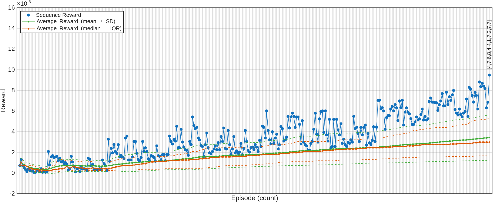

# Demo

Here we show how to implement a genome-scale biosimulation using our Matlab API.

### At a glance

In this brief document, we will describe the following (complete, with some variations) workflow:

```matlab
import Netabolics.*

% Select a model
Cell = Biology.Template.Model("generic");

% Select some phenotypes 
Healthy = Biology.Template.Phenotype(Cell,"normal");
Diseased = Biology.Template.Phenotype(Cell,"cancer");

% Simulate healthy-disease transition
Scenario = Biology.Simulation(Cell,[Healthy,Diseased]);
Scenario.solve();

% Display the 10 most affected species
Scenario.Statistics.Species(1:10)

% Deconvolve the disease-healthy transition
Task = AI.Agent(Diseased,Healthy);
Task.search();

% Display the best target combination
Task.Statistics.Combination(1)
```

A structure as simple as the above can be the starting point for more advanced analyses. For example, below we will also describe how to perform a basic target deconvolution task.


## 1. Initialize the toolbox

**IMPORTANT**: This will clear the current workspace, so it is recommended to include the following operations in your `startup.m` file:

```matlab
cd("/home/user/Netabolics/");
init__();
```

Let's add the Netabolics namespace to the current import list:
```matlab
import Netabolics.*
```
and we are ready to go.

## 2. Select a model
For our purposes, a model is a cellular network reconstruction. In principle, a model could also represent a multicellular system, but for now we work at the single-cell level. Often a model is not to be interpreted as a real individual entity (one single cell), but rather as a population of cells of the same type (homogeneous population), or in some cases as a population of cells of different type (heterogeneous population) from a specific tissue (e.g., something like an "average" cell). The level of detail depends on the datasets at hand, for example bulk RNAseq vs scRNAseq.

While it is possible to use third-party SBML models, we have developed our proprietary and manually curated models. The toolbox is guaranteed to work correctly only with our curated models.

Let's use our latest human cell template model:

```matlab
Cell = Biology.Template.Model("generic-10.22.89");
```

The model version (`10.22.89`) indicates the approximate number of genes (10K), molecular species including proteins and metabolites (22K), and gene-associated chemical reactions (89K).

The biological network models we use can be visualized as a directed hypergraphs using:

```matlab
Cell.plot(EdgeAlpha=0.2,Layout="force",UseGravity=true);
```

which produces the following figure:


Here species nodes are colored orange and reaction nodes/edges are colored blue.

## 3. Define phenotypes 

### 3.1 Using experimental data
The above template model comes with a default parametrization (e.g., species concentrations, reaction rates, etc). In order to be any useful, we need to associate a phenotype (i.e., a state) to the model. This step could be seen as a "differentiation" into a cell type and/or a given condition. 

To start with, we define a healthy generic phenotype for the model `Cell`: 

```matlab
Healthy = Biology.Template.Phenotype(Cell);
```

In the absence of data, this default template phenotype can already be used (e.g., for testing purposes). Of course, it is possible, and advisable, to load experimental datasets (e.g., RNAseq):

```matlab
Healthy.loadDataset("HealthySample.dat");
```

Similarly, we can load experimental datasets from diseased and treated patients (here using the `Biology.Phenotype` constructor directly, instead of loading the dataset into the template phenotype as done above):

```matlab
Diseased = Biology.Phenotype(Cell,"DiseasedSample.dat");
Treated = Biology.Phenotype(Cell,"TreatedSample.dat");
```

### 3.2 Using prebuilt templates
In the absence of data, and also to see some capabilities of the toolbox that are used for target deconvolution, let's see an example of defining phenotypes using prebuilt templates.

In this example, we use prebuilt phenotypes from the OncoDB public database (https://oncodb.org/) for a specific tissue as the healthy and diseased (here colon adenocarcinoma, COAD) states:

```matlab
Healthy = Biology.Template.Phenotype(Cell,"Tissue/OncoDB/DGE/COAD/normal");
Diseased = Biology.Template.Phenotype(Cell,"Tissue/OncoDB/DGE/COAD/cancer");
```

To implement a treatment, we can start from prebuilt drugs (here as a combination) and then define a treated phenotype by converting the therapy to a new phenotype:

```matlab
Therapy = Biology.Template.Drug(["aspirin","genistein"]);
Treated = Therapy.phenotype(Cell);
```

Overall, at the end of the above sequence of steps, we have the following:
- Model (`Cell`), created using a prebuilt template model.
- Healthy phenotype (`Healthy`), created using experimental data from normal tissue.
- Diseased phenotype (`Diseased`), created using experimental data from cancer tissue.
- Treated phenotype (`Treated`), created using drug combination.

With these in place, we can now proceed to the simulation phase. Notice, however, that depending on the specific goals, not all of the above phenotypes might be necessary (e.g., if we just want to see how a specific state looks like).

### 3.3 Using manual perturbations

Although very inefficient for large-scale models, manual perturbations can be useful for quick tests (e.g., during hypothesis generation).

The toolbox allows for the following perturbations to be handled manually:

- Absolute or relative changes of gene expression (e.g., mRNA levels). These are typically derived from **transcriptomics** data.
- Absolute or relative changes in species levels (e.g., protein abundance or metabolite concentration). These are typically derived from **proteomics** or **metabolomics** data.
- Relative changes in gene accessibility. These are typically derived from **epigenomics** data.
- Relative changes in protein function (e.g., gain-of-function or loss-of-function mutations). These are typically derived from **genomics** data together with a variety of experimental functional studies.

In addition, the following perturbations are available but extremely difficult to handle (not recommended):

- Absolute changes of protein activity rates (e.g., enzyme velocity). These are typically derived from **fluxomics** data.
- Absolute changes of gene expression rates (e.g., velocity of gene transcription). In principle, these could be derived from **time-resolved transcriptomics** data.  

Detailing manual perturbations is beyond the scope of the present demonstration. Here is a simple illustration:

```matlab
% Initialize an empty phenotype
Custom = Biology.Phenotype(Cell);

% Manually include a perturbation
Custom.addPerturbation("PTGS1","LOFM",0.5);
```

The above will result in a 50% loss-of-function mutation (LOFM) for PTGS1-encoded protein prostaglandin-endoperoxide synthase 1.


## 4. Simulate cellular state transitions
We can simulate the temporal evolution across phenotypes using our proprietary methods for creating and solving a dynamical system of ordinary differential equation (ODE) starting from the static model reconstruction and data. Of course, in real conditions the disease phenotype does not occur at-once as we do here (a more realistic picture would be possible if we had the temporal evolution of the diseased phenotype, which would require data to be acquired across the disease evolution time-span, something that however is seldom available in the practice).

```matlab
% Prepare the ODE system (with default settings)
Scenario = Biology.Simulation(Cell,[Healthy,Diseased,Treated]);

% Ensemble solving 
Scenario.solve(); 
```

We can now plot the results, for example the top 40 species with largest responses (these are automatically sorted for variance):

```matlab
figure(Color="w");

for i = 1:40
    subplot(4,10,i);
    Scenario.plot(i);
end
```

This will produce the following figure (notice that by default each phenotype is simulated for 24 hours):


We can obtain information on individual elements by visiting relevant online resources. For instance, to visit online resources for FABP1 (top left in the above figure) we do:

```matlab
FABP1 = Cell.SBML.species(Scenario.Statistics.species(1).Index);
URL = FABP1.cvterms(1).resources{:}; % 'https://identifiers.org/uniprot:P07148'

% Open URL in a web browser window
web(URL); 
```

The simulation results can be quickly examined by using predefined cellular processes of physiopathological significance. As an illustration, here we generate a table with the largest changes from healthy to diseased phenotype (first transition):

```matlab
Table = splitvars(struct2table(Scenario.Statistics.process));
Table.Change = Table.Mean_2-Table.Mean_1;

sortrows(Table,"Change","descend")
```

which will yield the following table (first 5 rows; not all columns are shown):

| Index | Symbol | Change | ... | Units |
| - | - | - | - | - | 
| 2129 | FATTY ACID OXIDATION | 140.67 | ... | "AU"    
| 2001 | ACTIN CYTOSKELETON REORGANIZATION | 130.45 | ... | "AU"    
| 2159 | GRANULOCYTE DIFFERENTIATION | 81.482 | ...| "AU"    
| 2389 | TRANSLATIONAL REGULATION | 70.218 | ... | "AU"    
| 2107 | DNA REPAIR | 66.312 | ... | "AU"  
| ... | ... | ... | ... | ... 


Notably, analysing changes in many thousands molecular species requires advanced statistical methods, which is beyond the scope of the present demonstration. 


## 5. Run target deconvolution

Now let's finally use AI to find the best treatment for a disease given a set of therapeutic options.

The computational workflow described thus far can be automatized by running it within our proprietary deep reinforcement learning (DRL) agent for target deconvolution. Specifically, once we have defined healthy and diseased phenotypes, we can proceed as follows.

First, we need to define which targets the agent has access to. We can let the agent use any set of already approved drugs (e.g., for drug repurposing programs), such as:

```matlab
Drugs = Biology.Template.Drug( ...
    [   "aspirin", ...      % rxcui:1191
        "genistein", ...    % rxcui:25696
        "vemurafenib", ...  % rxcui:1147220
        "paclitaxel", ...   % rxcui:56946
        "erlotinib", ...    % rxcui:337525
        "azacitidine", ...  % rxcui:1251
        "disulfiram", ...   % rxcui:3554
        "cytaribine" ...    % rxcui:3041
    ]);
```

Note that the above drugs model account for pleiotropy, as each of them typically modulates more than one target. If no drug is explicitly provided, the toolbox employs a default strategy that allows the agent to use "virtual target-specific drugs" to modulate each target individually (either as activator or inhibitor). In the case of the present model, the latter translates to about 20,000 virtual drugs.

**IMPORTANT**: The number and type of targets available to the agent affects the performance of the DRL algorithms, as the action (combinatorial) space changes accordingly. By default, the toolbox uses double deep Q network (DQN) based learning with discrete action space (i.e., drugs) with preconditioning (*) and continuous observation space (i.e., simulation outcomes).

(\*) *Preconditioning is based on preliminary simulations that provide a list of all targets ordered by the probability of their involvement in the phenotypic transition.*

Our overall goal is to ask the agent to find whatever combinations of drugs or targets that, when utilized on the digital cell, can favor a state transition from the diseased phenotype towards the healthy phenotype (e.g., minimizing a distance metric between the two phenotypes). 

Given the relatively small number of drugs we are testing in the present example, it is much more efficient to run a simple heuristic search first:

```matlab
Task = AI.Agent(Healthy,Diseased,Drugs); 
Task.search();
```

The default search proceeds incrementally by simulating the effect of drug combinations (i.e., sequences) on randomly chosen phenotype variants starting from one single drug and adding one drug at a time to "good" sequences (those already minimizing the distance between the phenotypes). Combined with preconditioning, this strategy rapidly prunes the action space for subsequent (computationally costly) DRL-based optimizations.

To run such a DRL-guided simulation (with default options) we do:

```matlab
Task.train();
```

As an illustration, the result of the above search are summarized in the following figure:



The search took few minutes across about 400 episodes. The sequence yielding the largest reward (approx. 10<sup>-5</sup>) was `[1,7,6,4,4,8,7,4,7,7]`, which corresponds to the combination of (in order of occurrences): disulfiram (4x), paclitaxel (3x), aspirin (1x), azacitidine (1x), and cytaribine (1x). Interestingly, the suggested drug disulfiram (currently being repurposed for cancer treatment) is fully consistent with the results of the simulation that indicated upregulation of fatty acid oxidation (see above).

Note however that the rewards associated with the above combinations is substantially (5-6 orders of magnitude) lower than the maximum reward of 1.0 for a complete reversal of diseased phenotype. Unconstrained search and/or agent training produce significantly better rewards (not shown).


## Conclusion

The Netabolics toolbox provides a streamlined interface for executing genome-scale biosimulations. The underlying data, which inform the models and phenotypes, are continuously updated as new knowledge emerges, and the methods undergo ongoing refinement. As a result, users should expect periodic updates that enhance predictive accuracy and expand functionality, though minor variations in results may occur.

This demo has introduced the fundamental features of the toolbox, including running basic tasks, handling output files, and managing disk space efficiently. For more complex analyses, users can extend these workflows by incorporating additional model parameters and data sources.


The toolbox evolves continuously to integrate the latest advancements in biosimulation and computational modeling. To stay informed about updates, new features, and best practices, follow us and subscribe to our repositories/newsletters.

The website provides documentation, example use cases, and news about ongoing developments. A Python wrapper will soon be released, allowing seamless integration of the toolbox into notebooks or API-based workflows, enabling users to leverage its computational power with minimal setup. We welcome user feedback and collaboration to further enhance the toolbox’s capabilities.


## Copyright Notice

This software is proprietary, and this document is provided for demonstration purposes only. 

For any inquiries, please [contact us](https://netabolics.ai/#contacts).

&nbsp;

Copyright &copy; 2020-2025 Netabolics SRL. All Rights Reserved.


